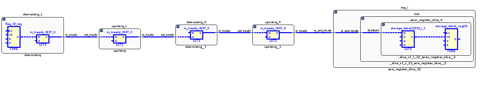

# Пример cascade

## Назначение

Пример демонстрирует каскадное включение нескольких компонентов upsing и downsizing

## Структурная схема

## Описание

Компонент __upsizing__ преобразует шину AXI Stream шириной 256 бит в шину шириной 512 бит.

Компонент __downsizing__ преобразует шину AXI Stream шириной 512 бит в шину шириной 256 бит.

Компоненты __upsizing__ и __downsizing__ не используют внутри себя буферизацию шин. Сигал __in_tready__ формируется на комбинационной схеме с учётом сигнала __out_tready__. В результате каскадного включения пяти компонентов формируется очень большая комбинационная схема.

## Результат

* Частота 667 МГц
* Levels: 5
* Fanout: 258
* Slack: -0.086

## Наиболее длиннный путь

