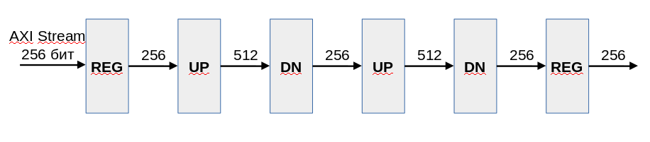
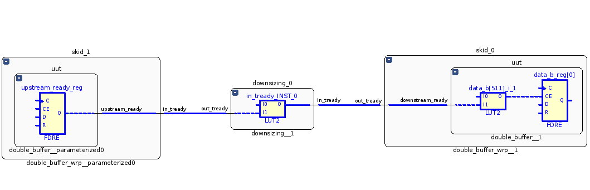

# Пример cascade_with_double

## Назначение

Пример демонстрирует каскадное включение нескольких компонентов upsing и downsizing с буферизацией на компоненте double_buffer.

## Структурная схема

## Описание

Компонент __upsizing__ преобразует шину AXI Stream шириной 256 бит в шину шириной 512 бит.

Компонент __downsizing__ преобразует шину AXI Stream шириной 512 бит в шину шириной 256 бит.

Компоненты __upsizing__ и __downsizing__ не используют внутри себя буферизацию шин. Сигал __in_tready__ формируется на комбинационной схеме с учётом сигнала __out_tready__.

Между компонентами __upsizing__ и __downsizing__ установлен компонент __double_buffer__ который разрывает комбинационную цепь между __out_tready__ и __in_tready__.

Компонент __double_buffer__ реализует классический вариант двойного буфера.

## Результат

* Частота 667 МГц
* Levels: 2
* Fanout: 520
* Slack: 0.459

## Наиболее длиннный путь

