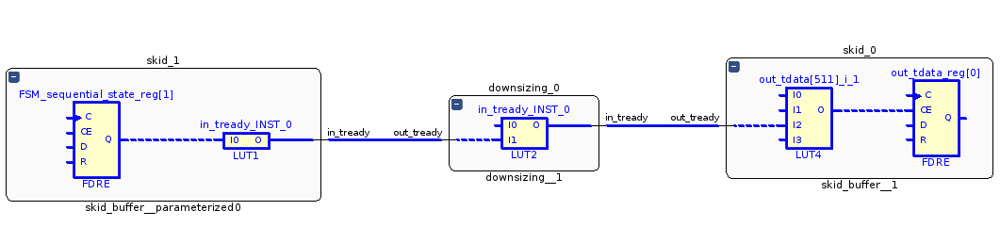
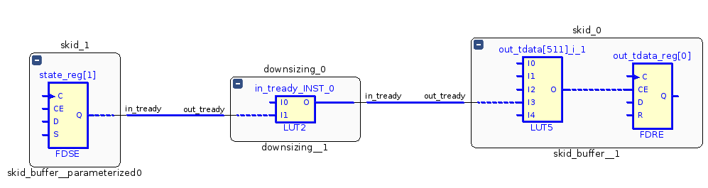

# Пример cascade_with_skid

## Назначение

Пример демонстрирует каскадное включение нескольких компонентов upsing и downsizing с буферизацией на компоненте double_buffer.

## Структурная схема

## Описание

Компонент __upsizing__ преобразует шину AXI Stream шириной 256 бит в шину шириной 512 бит.

Компонент __downsizing__ преобразует шину AXI Stream шириной 512 бит в шину шириной 256 бит.

Компоненты __upsizing__ и __downsizing__ не используют внутри себя буферизацию шин. Сигал __in_tready__ формируется на комбинационной схеме с учётом сигнала __out_tready__.

Между компонентами __upsizing__ и __downsizing__ установлен компонент __skid_buffer__ который разрывает комбинационную цепь между __out_tready__ и __in_tready__.

Компонент __skid_buffer__ реализует вариант двойного буфера на основе автомата с конечным числом состояний.

## Результат

* Частота 667 МГц
* Levels: 2
* Fanout: 512
* Slack: 0.547

## Наиболее длиннный путь без оптимизации

В пути находится компонент LUT1. Этот компонент разделяет две цепи с большим fanout но при этом он вносит дополнительную задержку.

## Наиболее длиннный путь c оптимизацией

В исходный код компонента внесён сигнал __in_ready_i__ который фактически повторяет сигнал state[1]. На сигнал __in_ready_i__ установлен атрибут KEEP что бы он не был удалён при оптимизации. В результате две большие цепи разделены и при синтезе не добавляется компонен LUT.

