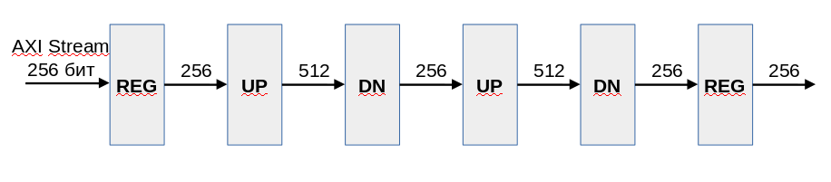
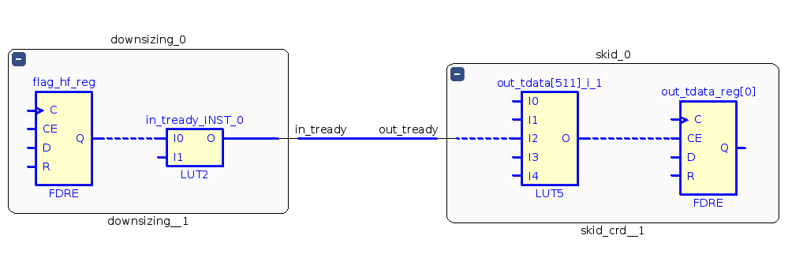

# Пример cascade_with_skid_crd

## Назначение

Пример демонстрирует каскадное включение нескольких компонентов upsing и downsizing с буферизацией на компоненте skid_crd.

## Структурная схема

## Описание

Компонент __upsizing__ преобразует шину AXI Stream шириной 256 бит в шину шириной 512 бит.

Компонент __downsizing__ преобразует шину AXI Stream шириной 512 бит в шину шириной 256 бит.

Компоненты __upsizing__ и __downsizing__ не используют внутри себя буферизацию шин. Сигал __in_tready__ формируется на комбинационной схеме с учётом сигнала __out_tready__.

Между компонентами __upsizing__ и __downsizing__ установлен компонент __skid_crd__ который реализует разрывает комбинационную цепь между __out_tready__ и __in_tready__.

Компонент __skid_crd__ реализует вариант двойного буфера с дополнительным регистром на входной шине данных.

## Результат

* Частота 667 МГц
* Levels: 2
* Fanout: 512
* Slack: 0.581

## Наиболее длиннный путь 

