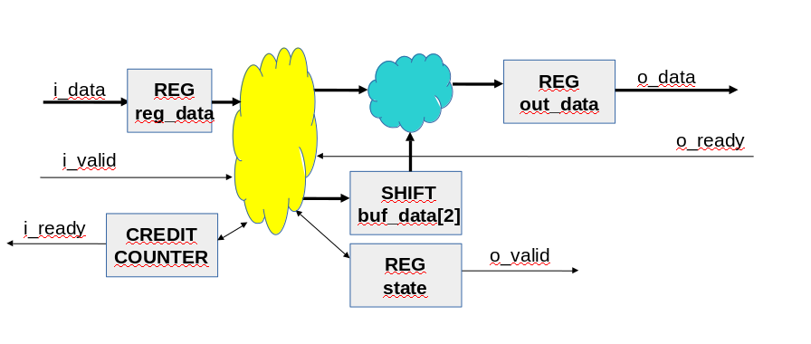

# Пример skid_crd

## Назначение

Пример демонстрирует работу реализации буфера с дополнительным регистром на входе.

## Структурная схема

## Описание

Двойной буфер используется для соединения двух компонентов с использованием интерфейса valid/ready. При этом исключаются связи между компонентами через комбинационную логику. 

В данном примере используется дополнительный регистр на входе данных. Этот регистр не имеет комбинационных входов и это позволяет улучшить трассировку.

Для формирования сигнала готовности на входной шине используется счётчик кредитов.

Пример сделан на основе шаблона chip-expo-2021-template-3-axi_stream.

Пример использует компонент FIFO из примера multipush_fifo.

Пример содержит два теста:
* direct - проверяются выделенные случаи
* randomize - проверка на случайных данных

## Запуск на EDA Playground

Адрес сайта: https://www.edaplayground.com/

На сайт требуется загрузить исходные файлы проекта и командный файл run.bash

Для работы надо выбрать симулятор Mentor Questa 2020.1

Возможно два режима выполнения:
1. Запуск одиночного теста.
2. Запуск группы тестов

Запуск одиночного теста производится обычным образом. Должен быть снят выбор с поля "Use run.bash"; В поле  "Run option" надо добавить параметр +test_id=<номер теста>. Выбранный тест будет запущен.

Запуск группового теста производится через файл run.bash; Необходимо поставить выбор на поле "Use run.bash". 

В каждом сеансе работы первым запуском должен быть запуск одиночного теста.

Временные диаграммы можно просмотреть на локальном компьютере. Для этого 
надо установить выбор в поле "Download files after run". Все файлы будут собраны в архив result.zip и загружены на локальный компьютер. В составе архива будет файл dump.vcd; Это файл содержит временные диаграммы и его можно просмотреть при помощи программы GTKWave.

## Использование Vivado

Необходимо открыть терминал и перейти в каталог vivado. При работе в Visual Studio Code возможно использование встроенного терминала.

Необходимо настроить переменные окружения для работы в выбранной версии Vivado. Текущая версия 2021.1.

В каталоге vivado содержатся командные файлы:

* compile.sh - для компилирования исходных текстов
* elaborate.sh - для сборки проекта
* c_run_0.sh - запуск теста test_id=0 в консольном режиме
* c_run_1.sh - запуск теста test_id=1 в консольном режиме
* g_run_0.sh - запуск теста test_id=0 в режиме GUI
* g_run_1.sh - запуск теста test_id=1 в режиме GUI
* all.sh - компиляция, сборка, запуск всех тестов в консольном режиме и формирование отчёта 

При выборе запуска в режиме GUI будет запущен симулятор Vivado. 

